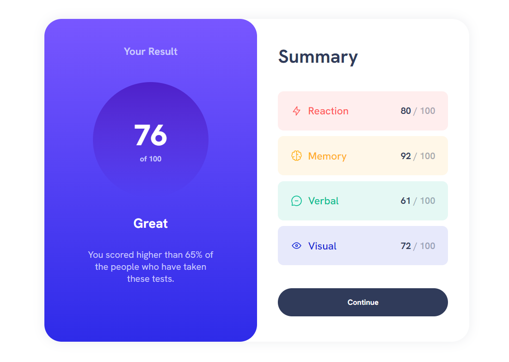

# Frontend Mentor - Results summary component solution

This is a solution to the [Results summary component challenge on Frontend Mentor](https://www.frontendmentor.io/challenges/results-summary-component-CE_K6s0maV).

## Table of contents

- [Overview](#overview)
  - [The challenge](#the-challenge)
  - [Screenshot](#screenshot)
  - [Links](#links)
- [My process](#my-process)
  - [Built with](#built-with)
  - [What I learned](#what-i-learned)
  - [Continued development](#continued-development)
  - [Useful resources](#useful-resources)
- [Author](#author)

## Overview

### The challenge

Users should be able to:

- View the optimal layout for the interface depending on their device's screen size
- See hover and focus states for all interactive elements on the page
- Deal with JSON file data

### Screenshot



### Links

- Solution URL: [github.com/VikashMaurya10](https://github.com/VikashMaurya10/results-summary-component-main)
- Live Site URL: [view🌐](https://vikashmaurya10.github.io/results-summary-component-main/)

## My process

### Built with

- Semantic HTML5 markup
- SCSS custom properties
- Flexbox
- jQuery
- Mobile-first workflow

### What I learned

I learned with the development of this task, How to get data form JSON file and how to manipulate the HTML file with DOM. In development process i use JavaScript library (jQuery).

To see how you can add code snippets, see below:

```js
$(document).ready(() => {
  // FETCHING DATA FROM JSON FILE
  $.getJSON("./data/data.json", (data) => {
    var scorecontainer = " ";
    // ITERATING THROUGH OBJECTS
    $.each(data, (key, value) => {
      //CONSTRUCTION OF ROWS HAVING
      scorecontainer += `<div id=${key} class="score d-f ai-c jc-sb">`;
      scorecontainer += `<div class="d-f ai-c g-p">`;
      scorecontainer += ``;
      scorecontainer += `<h2>${value.category}</h2>`;
      scorecontainer += `</div>`;
      scorecontainer += `<div class="number"><span>${value.score}</span> / 100</div>`;
      scorecontainer += `</div>`;
    });
    //INSERTING WHOLE DATA INTO HTML
    $(".scroes").append(scorecontainer);
  });
});
```

### Continued development

Working with JavaScript library (jQuery), I really liked the pattern of writting the code in jQuery and will use it going forward.

### Useful resources

- [Figma](https://www.figma.com) - This helped me for measuring the actual design. I really liked this pattern and will use it going forward.
- [fetch data from JSON file](https://www.geeksforgeeks.org/how-to-fetch-data-from-json-file-and-display-in-html-table-using-jquery/) - This is an amazing article which helped me to understand how fetch data from the given JSON file. I'd recommend it to anyone still learning this concept.

## Author

- Frontend Mentor - [@Vikashmaurya](https://www.frontendmentor.io/profile/VikashMaurya10)
- LinkedIn - [@in-vikashmaurya](https://www.linkedin.com/in/in-vikashmaurya)
